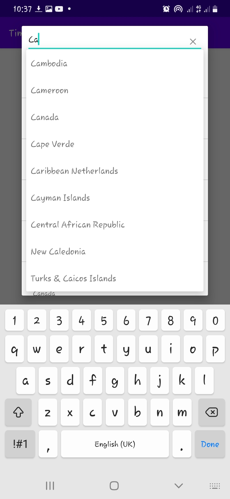
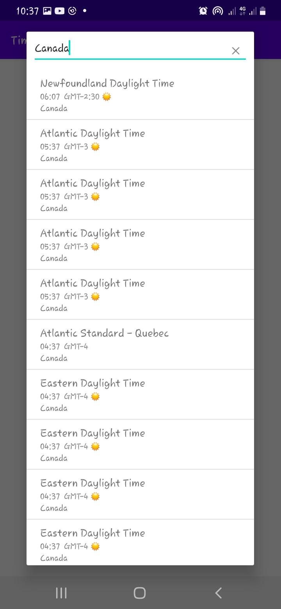
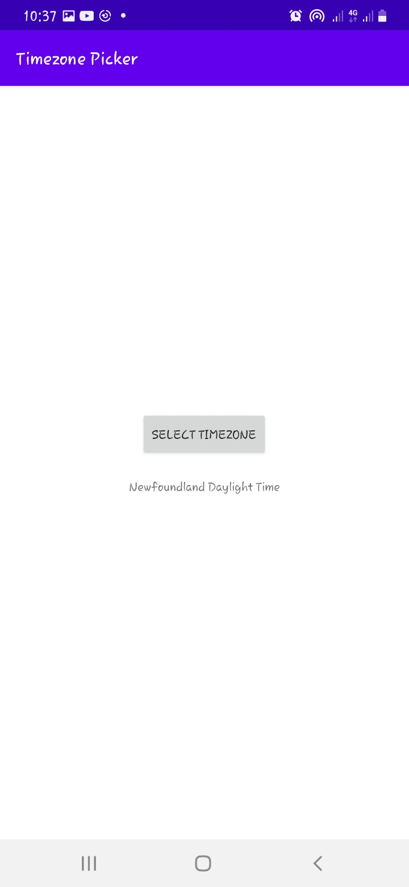

# Android Timezone Picker


An android timezone picker implementation that is based
on [Google's](https://android.googlesource.com/platform/frameworks/opt/timezonepicker)
implementation where you can select timezones based on country.

Instead of using the on device timezone information which would usually be outdated depending on
when the device last received an update, this library ships with it's own timezone database. It also
takes into account daylight savings.

### Screenshots

|  Country                                                   |  Country Timezones                                         |  After Selection                                           |
|------------------------------------------------------------|------------------------------------------------------------|------------------------------------------------------------|
|  |  |  |

### Building Overview

This library relies on files from different sources i.e

1. [Google timezone picker](https://android.googlesource.com/platform/frameworks/opt/timezonepicker)
   which just provides the picker interface
    - Added as a submodule to this repository for easier tracking
    - Needs to use appcompat views to support dark and light mode
    - Needs [zone.tab](https://github.com/eggert/tz/blob/main/zone.tab)
      and [backward](https://github.com/eggert/tz/blob/main/backward) for the timezone data.
2. [Time zone database](https://github.com/eggert/tz) for up-to date timezone data
   
These additional dependencies are managed and updated by gradle on building the project

### Usage

A sample module is provided for reference, but for picking the timezone in an activity context
implementing `TimeZonePickerDialog.OnTimeZoneSetListener`

```kotlin
val args = Bundle()
args.putLong(
    TimeZonePickerDialog.BUNDLE_START_TIME_MILLIS,
    ZonedDateTime.now().toEpochSecond() * 1000
)
args.putString(
    TimeZonePickerDialog.BUNDLE_TIME_ZONE,
    ZonedDateTime.now().zone.id
)

val timeZonePickerDialog = TimeZonePickerDialog()
timeZonePickerDialog.arguments = args
timeZonePickerDialog.setOnTimeZoneSetListener(this)
timeZonePickerDialog.show(fragmentManager, TimeZonePickerDialog.TAG)
```

and listening for the result

```kotlin
  override fun onTimeZoneSet(tzi: TimeZoneInfo?) {
    if (tzi != null) {
        findViewById<AppCompatTextView>(R.id.txt_timezone).text = tzi.mDisplayName
    }
}
```

### Contribution

Fork and send a pull request 😉, or an issue...

### License

```
Copyright 2022 Richard Muvirimi

Licensed under the Apache License, Version 2.0 (the "License");
you may not use this file except in compliance with the License.
You may obtain a copy of the License at

    http://www.apache.org/licenses/LICENSE-2.0

Unless required by applicable law or agreed to in writing, software
distributed under the License is distributed on an "AS IS" BASIS,
WITHOUT WARRANTIES OR CONDITIONS OF ANY KIND, either express or implied.
See the License for the specific language governing permissions and
limitations under the License.
```
